**DishDiva** is a web application where you can browse its recipes and made up your mind about what are you going eat today. this website inspired from NYT cooking recipes and built using Python, React.js and SQLAlchemy. It allows users to create free accounts, share their favorite recipes, and perform full CRUD functionallity on recipes, ingredients, preparations, and leaving cooking notes to the chef. 

ِExplore and share your favorite recipe at: [DishDiva](https://dishdiva-t3d2.onrender.com/)

## List of techs/languages/plugins/APIs used
- React.js

- Redux

- Python

- Flux

- PostgreSQL

- Flask

- Render

- CSS

- HTML

- Alembic
  
- AWS S3

## Landing Page,Home Page
in the home page, when a user not logged in, there are some recipes shared from different user and Log in/Sign up options are avaliable. also a demo button is avalible for quick exploration of the site. When a user logged in or signed up, he will be able to create his own recipes and browse different recipes. 

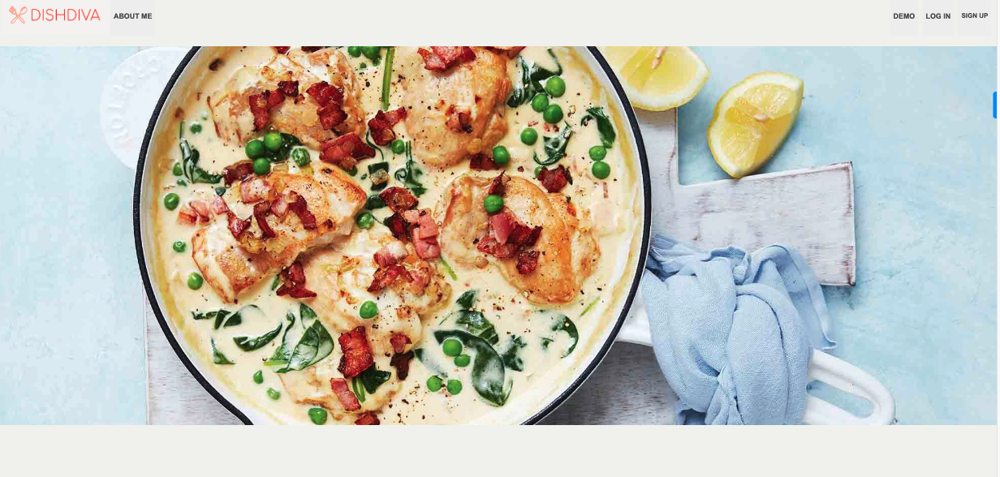

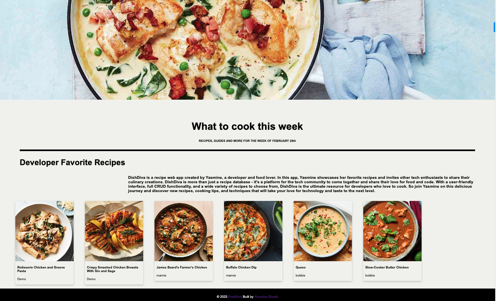

Login Page

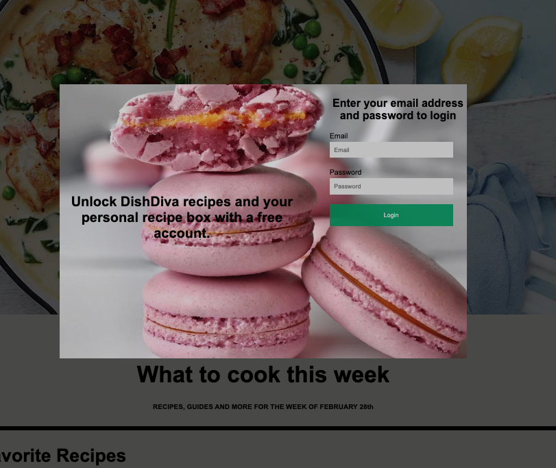

Signup Page

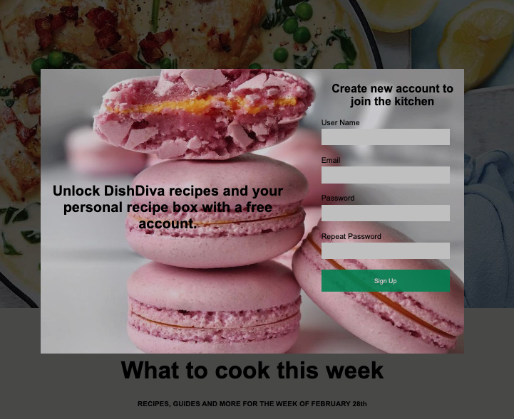

Dropdown menu

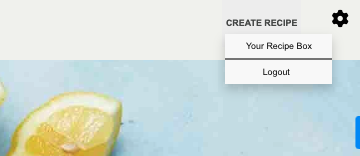

## Recipe page

when a user logged in, he would be able to check all the avaliable recipes including ingredients, preparaions, and he cna leave a cooking note.

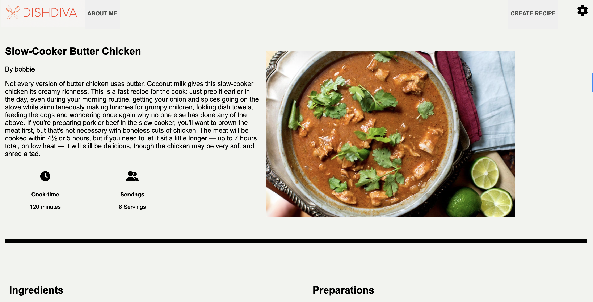

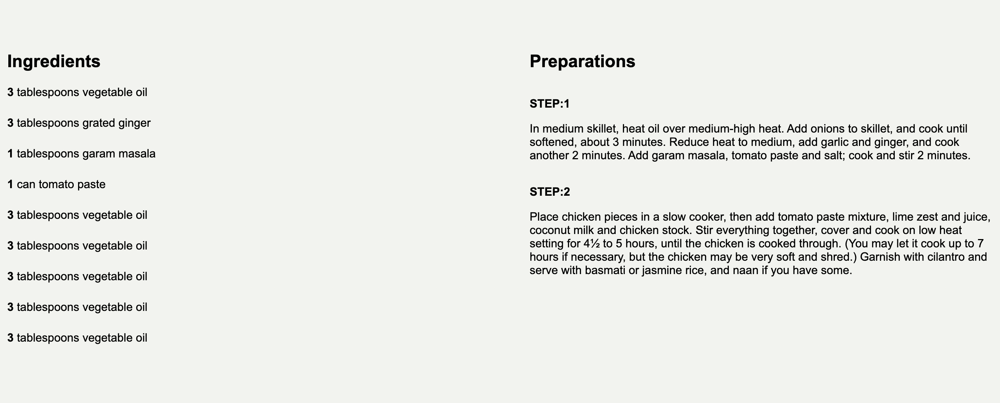

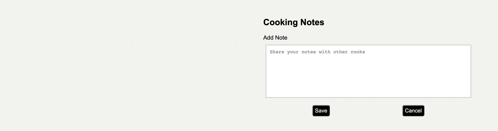

## User Profile Page

The user profile page includes all his recipes and he can create his new recipe from the share recipe button. 

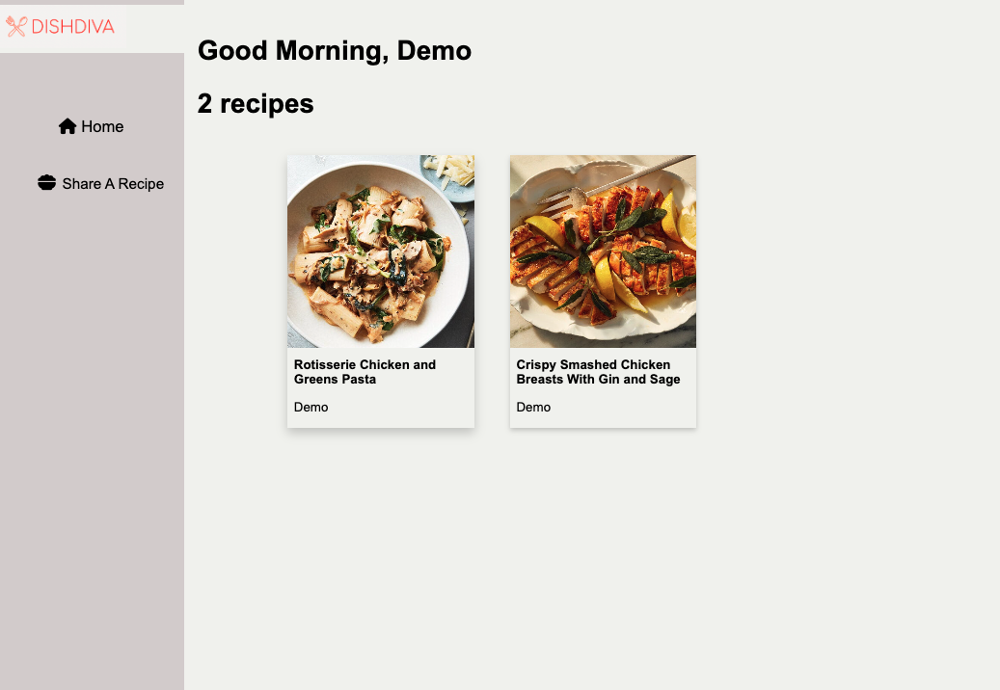

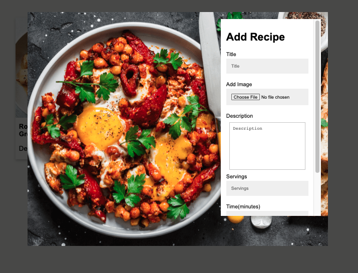

## Update Recipe

In the recipe page, only the owner of the recipe can update the recipe information. 

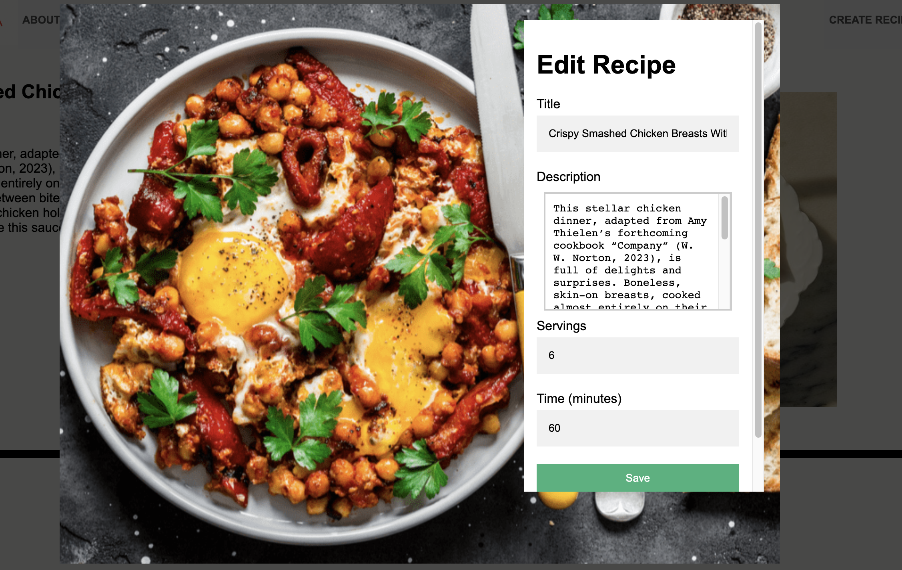

## Create and Update Ingredients

In the recipe page, the owner of the recipe can create and update ingredients if he wants. 

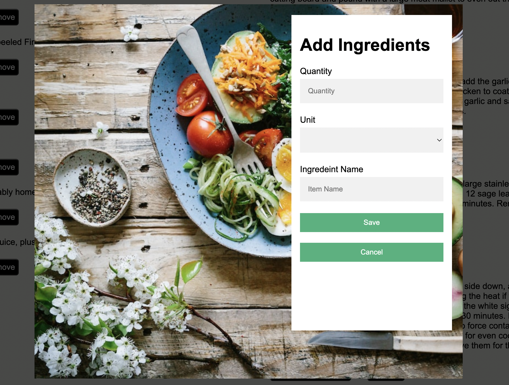

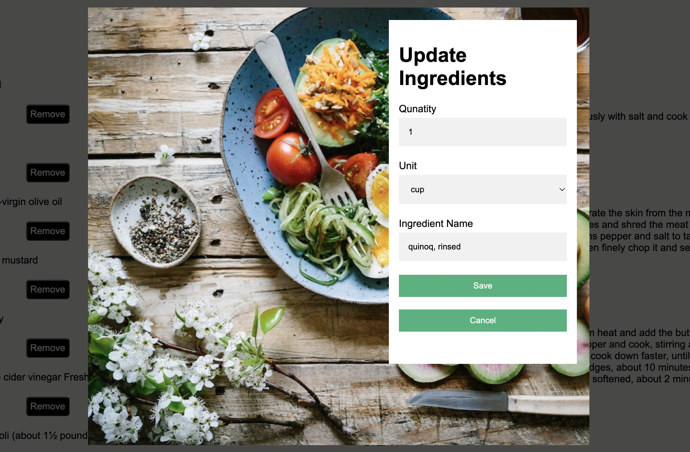

## Create and Update Preparations

In the recipe page, the owner of the recipe can create and update preparations if he wants. 

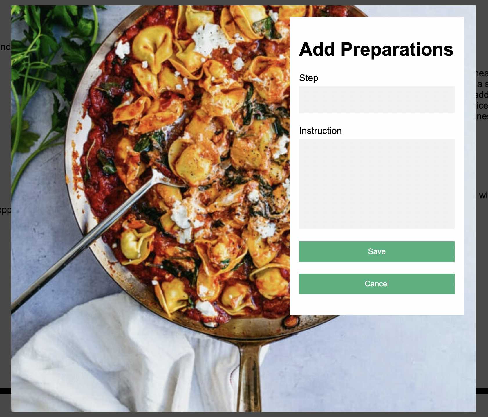

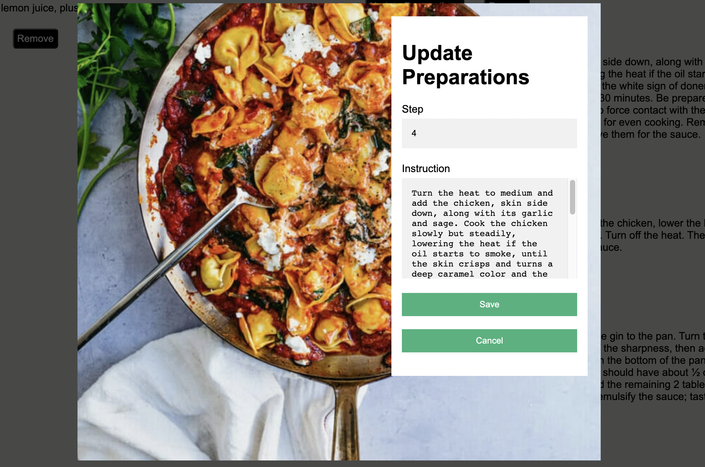

## Create and Update Cooking Notes

In any recipe, a user can leave a cooking note and update it if needed. 

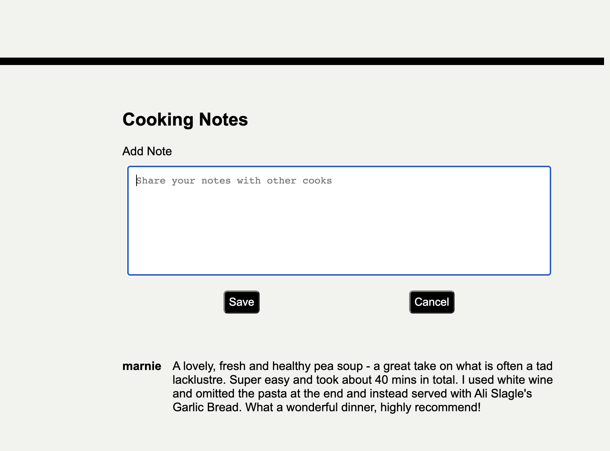

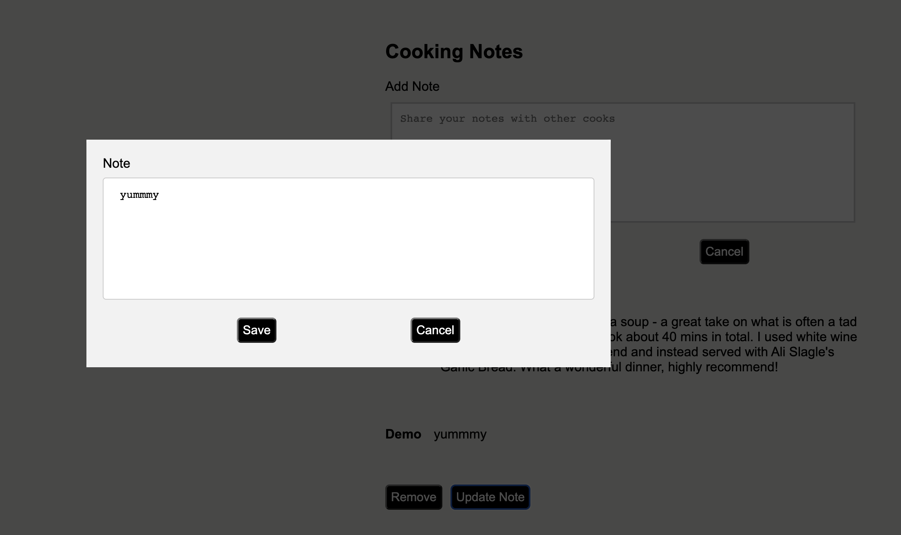

## Instructions on how to build/run the project

[Instructions](https://github.com/YElnadi/DishDiva2/blob/main/README2.md)

## To-dos/future features
 I'm working on adding more features to DishDiva such as:
- Search
- Reviews
- Favorits Recipes

